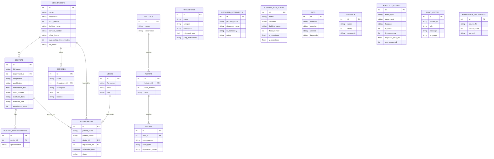

# Entity-Relationship Diagram

```mermaid
erDiagram
    DEPARTMENTS ||--o{ DOCTORS : has
    DEPARTMENTS ||--o{ SERVICES : offers
    BUILDINGS ||--o{ FLOORS : contains
    FLOORS ||--o{ ROOMS : contains
    DOCTORS ||--o{ DOCTOR_SPECIALIZATIONS : has
    DOCTORS ||--o{ APPOINTMENTS : booked_for
    DEPARTMENTS ||--o{ APPOINTMENTS : booked_for
    USERS ||--o{ APPOINTMENTS : "may create"

    DEPARTMENTS {
        int id PK
        string name
        string description
        int floor_number
        string building_name
        string contact_number
        string office_hours
        int avg_waiting_time_minutes
        string keywords
    }
    DOCTORS {
        int id PK
        string full_name
        int department_id FK
        string designation
        string qualification
        float consultation_fee
        string room_number
        string available_days
        string available_time
        int experience_years
    }
    DOCTOR_SPECIALIZATIONS {
        int id PK
        int doctor_id FK
        string specialization
    }
    BUILDINGS {
        int id PK
        string name
        string description
    }
    FLOORS {
        int id PK
        int building_id FK
        int floor_number
        string label
    }
    ROOMS {
        int id PK
        int floor_id FK
        string room_number
        string room_type
        string department_name
    }
    SERVICES {
        int id PK
        string name
        int department_id FK
        string description
        float fee
        string location
    }
    PROCEDURES {
        int id PK
        string name
        string category
        string description
        float estimated_cost
        string prep_instructions
    }
    REQUIRED_DOCUMENTS {
        int id PK
        string process_name
        string document_name
        string is_mandatory
        string notes
    }
    HOSPITAL_MAP_POINTS {
        int id PK
        string name
        string category
        string building_name
        int floor_number
        float x_coordinate
        float y_coordinate
    }
    APPOINTMENTS {
        int id PK
        string patient_name
        string patient_contact
        int doctor_id FK
        int department_id FK
        datetime scheduled_time
        string status
    }
    FAQS {
        int id PK
        string category
        string question
        string answer
        string keywords
    }
    FEEDBACK {
        int id PK
        string name
        int rating
        string comments
    }
    ANALYTICS_EVENTS {
        int id PK
        string event_type
        string department
        string language
        int is_voice
        int is_emergency
        float response_time_ms
        int was_answered
    }
    CHAT_HISTORY {
        int id PK
        string session_id
        string role
        string message
        string language
    }
    USERS {
        int id PK
        string full_name
        string email
        string role
    }
    KNOWLEDGE_DOCUMENTS {
        int id PK
        string source_file
        int chunk_index
        string content
    }
```
