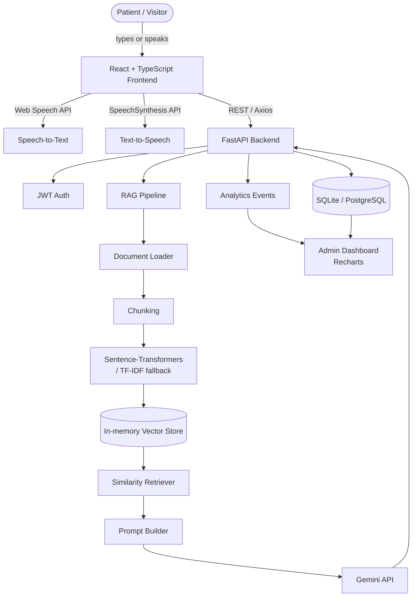
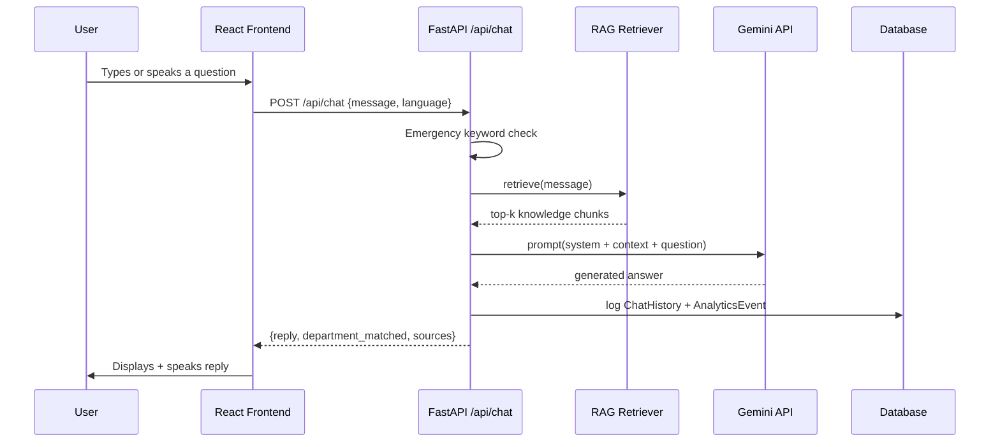
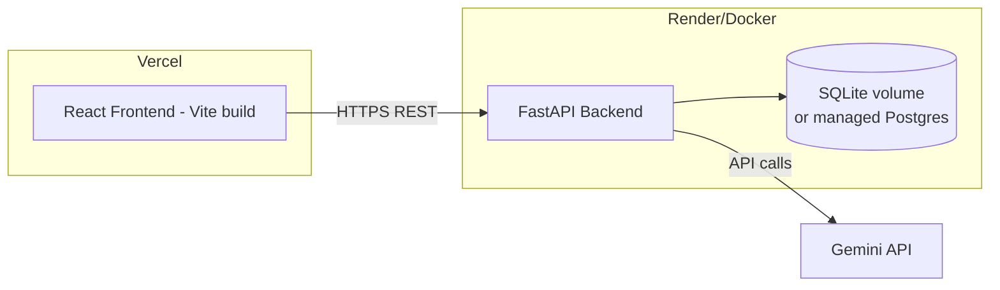

# System Architecture

## High-Level Architecture

## Data Flow (Chat Request)

## Deployment Architecture

## Why SQLite + in-memory vectors instead of Postgres + ChromaDB
For a hackathon-scale build, SQLite (via SQLAlchemy) and an in-memory
NumPy vector store remove all external infrastructure dependencies —
the whole stack runs with `uvicorn app.main:app` and `npm run dev`,
no database server or vector DB container required. Both are drop-in
replaceable: swap `DATABASE_URL` to a Postgres DSN, or swap
`app/rag/vector_store.py` for a ChromaDB-backed implementation,
without touching any other module — every other layer only calls
`.add()` / `.search()` or standard SQLAlchemy sessions.
